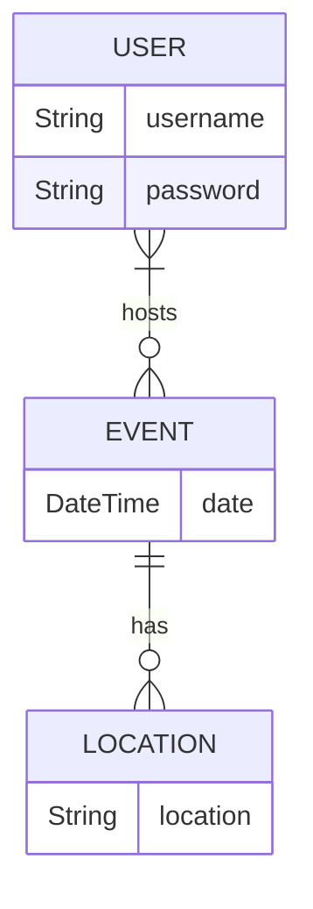

# Database

`mysql -u root -p`

## Data Model Planning
Core Entities: Events, Users, Location

Key Relationships: Users can host Events, Events can have multiples Users, Events have one location, Locations can host multiple events

## Entity Relationship Diagram (ERD)

## Database

| users | | 
| --- | --- |
| user_id | PRIMARY KEY |
| user_name | varchar(100) |

| locations | | 
| --- | --- |
| location_id | PRIMARY KEY |
| location_name | varchar(100) |
| address | varchar(255) |

| games | | 
| --- | --- |
| game_id | PRIMARY KEY |
| ganes_name | varchar(100) |
| location_id | FOREIGN KEY |

| games_users | | 
| --- | --- |
| game_user_id | PRIMARY KEY |
| user_id | FOREIGN KEY |
| game_id | FOREIGN KEY |

SQL Generate script [here](./create_tables.sql).