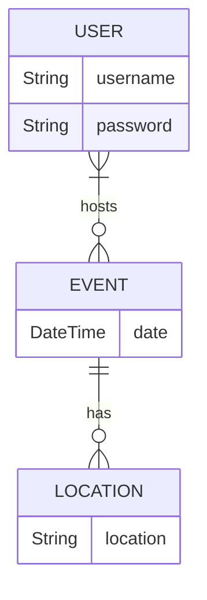

# Database

`mysql -u root -p`

## Data Model Planning
Core Entities: Events, Users, Location

Key Relationships: Users can host Events, Events can have multiples Users, Events have one location, Locations can host multiple events

## Entity Relationship Diagram (ERD)
